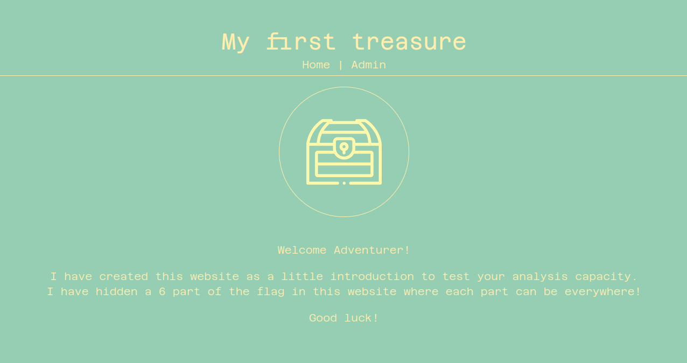
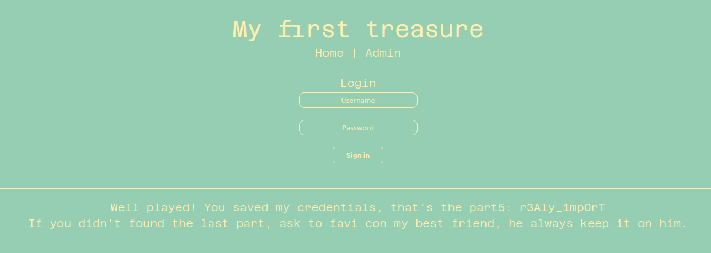
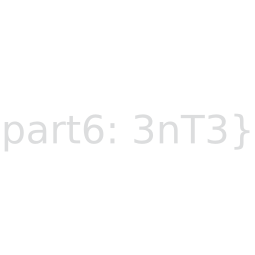

# My first treasure

Here is my writeup of first web challenge from a private CTF. (Challenge by Mizu)

Task: Searching for some rupees, Link found a website that is hiding a treasure. Find a way to open it! 

## First look

Firstly, we have a little brief page.



We have to find 6 parts of the flag hidden in the website.

## First part

They are hidden so first we'll check HTML source code, CTRL + U is our friend :)

```html
<!DOCTYPE html>
<html lang="en">
<head>
    <title>My first treasure</title>
    <meta charset="UTF-8">

    <!--- favicon -->
    <link rel="icon" type="image/png" href="/static/images/favicon.png"/>

    <!--- css -->
    <link rel="stylesheet" property="stylesheet" type="text/css" href="/static/css/style.css" media="all">
</head>
<body>
    <h1>My first treasure</h1>
<p><a href="/">Home</a> | <a href="/admin">Admin</a></p>
<div class="line"></div>
    <div class="mgb-2"><i onclick="alert('tin tin tin tiiiiiin')"></i><div>
    <p class="mgt-2 mgb-1"> Welcome Adventurer! </p>
    <p> I have created this website as a little introduction to test your analysis capacity. </p>
    <p class="mgb-1"> I have hidden a 6 part of the flag in this website where each part can be everywhere! </p>
    <p> Good luck! </p>
    <p style="color: #96CEB4"> Like here for exemple - Flag part 1: R2Lille{ </p>
    <script src="/static/js/main.js"></script>
</body>
</html>
```

We can see the first part: ``R2Lille{``, we are too fast :p

We'll make a better analysis of this source code and check all the links (images, css, js...)

## Second part

So, now we are going to check the CSS sources:

```css
.flag { color: red; }
.part2 { color: red; }
.Ch3Ak1 { color: red; }
```

I let you only the part we the second part of our flag! 

Our flag: ``R2Lille{Ch3Ak1``

## Third

Let's have a look for the javascript code:

```js
// Init
texts = ["An enemy approch!", "You found a chest!", "Wait this is realy a flag?!", "Nice sword man!", "Hé ho hé", "Tutuluuu!", "You found a cool shield!", "10 rupees for the beer!"]

function getRandomInt(max) {
	return Math.floor(Math.random() * max);
}

// Write console msg 
var write = () => {
	x = getRandomInt(texts.length)
    console.log(texts[x])
};

// Infinity run
setInterval(write, 10000);

// Part 3: NG_HTML
// Robots seems to have steal admin credentials, please help me to find them back
```

Yeah! We have our third part! We can add it to our flag: ``R2Lille{Ch3Ak1NG_HTML``

## Fourth part

Hum in the javascript code we can see that robots have stolen admin credentials... But why robots ? Hummmmm, ``/robots.txt``!

```
User-agent: Admin credentials
Allow username: part4
Allow password: _C4n_B3_
```

Yeah we are right, here is our fourth part! (Always check /robots.txt :p)

Flag: ``R2Lille{Ch3Ak1NG_HTML_C4n_B3_``

## Fifth part

So we have admin credentials, let's connect to admin panel on ``/admin``.



Yeah we are close to flag!

Flag: ``R2Lille{Ch3Ak1NG_HTML_C4n_B3_r3Aly_1mp0rT``

## Sixth part

We can see a little message from the administrator, he says that fav icon, his friend has the last part.. Fav icon ?

I told you to check all the links in source code :angry:

Let's get ``/static/images/favicon.png``



## Conclusion

We finally have all parts of the flag!

Final flag: ``R2Lille{Ch3Ak1NG_HTML_C4n_B3_r3Aly_1mp0rT3nT3}``

A cool analysis challenge :p